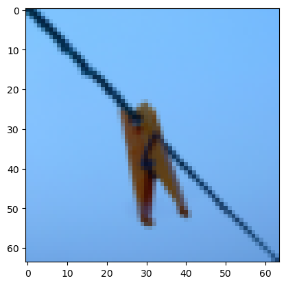

# Neural Network with two layer (Tanh, sigmoid)

the program steps for designing a two-neuronal network system. The system is made up of two hidden layers, the first of which uses tanh as an activation function and the second of which uses a sigmoid function. The figure below shows the structure of a two-layer neural network. The layer can have any number of units.


**Mathematically**:

For one example $x^{(i)}$:
$$z^{[1] (i)} =  W^{[1]} x^{(i)} + b^{[1]}\tag{1}$$ 
$$a^{[1] (i)} = \tanh(z^{[1] (i)})\tag{2}$$
$$z^{[2] (i)} = W^{[2]} a^{[1] (i)} + b^{[2]}\tag{3}$$
$$\hat{y}^{(i)} = a^{[2] (i)} = \sigma(z^{ [2] (i)})\tag{4}$$
$$y^{(i)}_{prediction} = \begin{cases} 1 & \mbox{if } a^{[2](i)} > 0.5 \\ 0 & \mbox{otherwise } \end{cases}\tag{5}$$

Given the predictions on all the examples, you can also compute the cost $J$ as follows: 
$$J = - \frac{1}{m} \sum\limits_{i = 0}^{m} \large\left(\small y^{(i)}\log\left(a^{[2] (i)}\right) + (1-y^{(i)})\log\left(1- a^{[2] (i)}\right)  \large  \right) \small \tag{6}$$


**The implementation steps**: The general methodology to build a Neural Network with two layer is to:

    1. Define the neural network structure ( # of input units,  # of hidden units, etc). 
    2. Initialize the model's parameters
    3. Loop:
        - Implement forward propagation
        - Compute loss
        - Implement backward propagation to get the gradients
        - Update parameters (gradient descent)

1- Layer size


```python
def layer_sizes(X, Y):
    """
    Argument:
    X: The dataset (number of feactures, number of examples)
    Y: labels of shape (output size, number of examples) # because the sigmoid is used , the output shape is (1, m)

    Return:
    n_x -- Number of features in one example
    n_h -- Number of units in first layer
    n_y -- Number of units in output layer (sigmoid = 1)
    """
    n_x = X.shape[0]
    n_y = Y.shape[0]

    return n_x, n_y
```

2- Initialize parameters $(W^{[1]}, b^{[1]}, W^{[2]}, b^{[2]})$ two weights because two layer 


```python
def initialize_parameters(n_x, n_h, n_y):
    """
    Argument: 
    n_x -- Number of features in one example
    n_h -- Number of units in first layer
    n_y -- Number of units in output layer (sigmoid = 1)

    Return:
    W1: Weight matrix for layer one with a shape of (n_h, n_x).
    b1: Bais vector of (n_h, 1) shape.
    W2: Weight matrix for layer two with a shape of (n_y, n_h)
    b1: Bais vector of (n_y, 1) shape. 
    """

    W1 = np.random.randn(n_h, n_x) * 0.01
    b1 = 0.0
    W2 = np.random.randn(n_y, n_h) * 0.01
    b2 = 0.0

    parameters = {
        "W1":W1,
        "b1":b1,
        "W2":W2,
        "b2":b2
    }
    return parameters
```

3. Forward propagation 

To calculate A1 and A2 in this section, we must first compute the linear component (Z1) and then Z2. However, we should first establish the sigmoid function and the tanh function.


```python
def sigmoid(Z):

    A = 1/(1 + np.exp(-Z))

    return A
```


```python
def tanh(Z):
    A = (np.exp(Z) - np.exp(-Z))/(np.exp(Z) + np.exp(-Z))
    return A
```


```python
def forward_propagation(X, parameters):
    """
    Argument:
    X: the dataset
    parameters: a Python dictionary containing all of the weights and baises
    n_h is the number of hidden layers.

    Return: 
    A: activation function results
    cache: a dictionary containing "Z1", "A1", "Z2", and "A2" is used in the backpropagation stage.
    """

    W1 = parameters['W1']
    b1 = parameters['b1']
    W2 = parameters['W2']
    b2 = parameters['b2']

    Z1 = np.dot(W1, X) + b1
    A1 = tanh(Z1)
    Z2 = np.dot(W2, A1) + b2
    A2 = sigmoid(Z2)

    cache = {"Z1": Z1,
             "A1": A1,
             "Z2": Z2,
             "A2": A2}

    return A2, cache
```

4. Compute Cost


```python
def compute_cost(A2, Y):
    """
    Argument:
    A2: output of last layer 
    Y: actual output

    Return:
    cost: cross-entropy cost 
    """

    # Number of examples
    m = Y.shape[1]

    cost = logprobs = np.multiply(np.log(A2), Y) + np.multiply(np.log(1 - A2), 1-Y)
    cost = -np.sum(logprobs) / m
    cost = np.squeeze(cost)

    return cost
```

5. Backpropagation


```python
def backpropagation(parameters, cache, X, Y):
    """
    Argument:
    parameters: A Python dictionary containing all weights and biases
    caches: a Python dictionary contains Z1, A1, Z2, and A2.    
    X: dataset     
    Y: actual output

    Return:

    grads -- python dictionary containing your gradients with respect to different parameters
    """

    m = X.shape[1]

    W1 = parameters["W1"]
    W2 = parameters["W2"]
    
    A1 = cache['A1']
    A2 = cache['A2']

    # dJ/dz = dj/da2 . da2/dz2 = A2-y
    dZ2 = A2 - Y

    # dJ/dw2 = dj/dz2. dz2/dw2 = dZ2 . ((A1.T) = X2)
    dW2 = np.dot(dZ2, A1.T) / m

    # dJ/db2 = dj/dz2. dz2/db2 = 1/m(dZ2 . 1)
    db2 = np.sum(dZ2, axis=1, keepdims=True) / m

    # dJ/dZ1 = dJ/dA1 . dA1/dZ1 = (1-A1)**2
    # Where dJ/dA1 Z2= w2A2+b
    dZ1 = np.dot(W2.T, dZ2) * (1 - np.power(A1, 2))

    # dJ/dW1 = dJ/dZ1 . dZ1/dW1 = dZ1.X1
    dW1 = np.dot(dZ1, X.T) / m

    # dJ/db1 = dJ/dZ1 . dZ1/db1 = dZ1.1
    db1 = np.sum(dZ1, axis=1, keepdims=True) / m

    grads = {
        "dW1": dW1,
        "db1": db1,
        "dW2": dW2,
        "db2": db2
    }

    return grads
```

6. Update parameters


```python
def update_prameters(parameters, grads, learning_rate=0.005):
    """
    Argument: 
    parameters: A Python dictionary containing all weights and biases
    grads: python dictionary containing your gradients with respect to different parameters

    Return:

    parameters: python dictionary containing your updated parameters 

    """

    W1 = parameters["W1"]
    b1 = parameters["b1"]
    W2 = parameters["W2"]
    b2 = parameters["b2"]

    dW1 = grads["dW1"]
    db1 = grads["db1"]
    dW2 = grads["dW2"]
    db2 = grads["db2"]

    W1 = W1 - learning_rate * dW1
    b1 = b1 - learning_rate * db1
    W2 = W2 - learning_rate * dW2
    b2 = b2 - learning_rate * db2

    parameters = {"W1": W1,
                  "b1": b1,
                  "W2": W2,
                  "b2": b2}

    return parameters
```

7. The whole model


```python
def nn_model(X, Y, n_h, num_iterations=10000, print_cost=False):
    """
    Argument:
    X: Dataset
    Y: Actual output
    n_h: number of units in first layer
    num_iterations
    print_cost:


    Return:
    parameters: parameters learnt by the model. They can then be used to predict
    """
#     np.random.seed(3)

    n_x, n_y = layer_sizes(X, Y)

    parameters = initialize_parameters(n_x, n_h, n_y)
    
    for i in range(num_iterations):
        
        A2, cache = forward_propagation(X, parameters)

        cost = compute_cost(A2, Y)

        grads = backpropagation(parameters, cache, X, Y)

        parameters = update_prameters(parameters, grads)
        
        if i % 1000 == 0 and print_cost:
            print("Cost after iteration %i: %f" %(i, cost))

    return parameters
```

8. predict 


```python
def predict(parameters, X, Y):
    
    A2, cache = forward_propagation(X, parameters)

    predictions = A2 > 0.5

    count = 0
    exmaple_num = X.shape[1]
    
    for i in range(exmaple_num):
        if predictions[0, i] == Y[0, i]:
            count += 1

    accuracy = count / exmaple_num

    return accuracy, predictions
```


```python
import numpy as np
import h5py
    
def load_dataset():
    
    # load the training data from train_catvnoncat.h5 file
    
    train_dataset = h5py.File('datasets/train_catvnoncat.h5', "r")
    train_set_x_orig = np.array(train_dataset["train_set_x"][:]) # your train set features
    train_set_y_orig = np.array(train_dataset["train_set_y"][:]) # your train set labels

    # load the test data from test_catvnoncat.h5 file
    
    test_dataset = h5py.File('datasets/test_catvnoncat.h5', "r")
    test_set_x_orig = np.array(test_dataset["test_set_x"][:]) # your test set features
    test_set_y_orig = np.array(test_dataset["test_set_y"][:]) # your test set labels

    classes = np.array(test_dataset["list_classes"][:]) # the list of classes
    
    # train_set_y_orig.shape = (209,)
    train_set_y_orig = train_set_y_orig.reshape((1, train_set_y_orig.shape[0]))
    # train_set_y_orig.shape = (1,209)
    test_set_y_orig = test_set_y_orig.reshape((1, test_set_y_orig.shape[0]))
    
    return train_set_x_orig, train_set_y_orig, test_set_x_orig, test_set_y_orig, classes
```


```python
# Training Acuraccy
```


```python
train_set_x_orig, train_set_y, test_set_x_orig, test_set_y, classes = load_dataset()

num_of_sample, width_of_image, heigh_of_image, channel = train_set_x_orig.shape

train_set_x_flatten = train_set_x_orig.reshape(num_of_sample, width_of_image*heigh_of_image*channel)

train_set_x = train_set_x_flatten.T / 255.
```


```python
parameters = nn_model(train_set_x, train_set_y, n_h = 8, num_iterations = 10000, print_cost=True)
```

    Cost after iteration 0: 0.692906
    Cost after iteration 1000: 0.508651
    Cost after iteration 2000: 0.200206
    Cost after iteration 3000: 0.080881
    Cost after iteration 4000: 0.042472
    Cost after iteration 5000: 0.027226
    Cost after iteration 6000: 0.019631
    Cost after iteration 7000: 0.015178
    Cost after iteration 8000: 0.012279
    Cost after iteration 9000: 0.010251
    


```python
training_examples_accuracy = predict(parameters, train_set_x, train_set_y)[0]
print("The accuracy of the training example", training_examples_accuracy * 100, "%")
```

    The accuracy of the training example 100.0 %
    


```python
# Test accuracy
```


```python
num_of_sample, width_of_image, heigh_of_image, channel = test_set_x_orig.shape

# Convert (50, 64, 64, 3) to (50, 12288)
test_set_x_orig_flatten = test_set_x_orig.reshape(num_of_sample, width_of_image*heigh_of_image*channel)

# Convert (50, 12288) to (12288, 50) and normalization 
test_set_x = test_set_x_orig_flatten.T / 255.
```


```python
test_examples_accuracy = predict(parameters, test_set_x, test_set_y)[0]
print("The accuracy of the training example", test_examples_accuracy * 100, "%")
```

    The accuracy of the training example 68.0 %
    


```python
# The system accepts only shapes in the form of (112288, for example).
# As a result, the single example must be converted to (number of features , number of examples). 

import random
index = random.randint(0, 208)

import matplotlib.pyplot as plt
plt.imshow(train_set_x_orig[index])

image = train_set_x[:, index].reshape(-1, 1)
image_y = train_set_y[:, index].reshape(-1, 1)

im = predict(parameters, image, image_y)

if im[1][0][0]:
    print(" This image contains a cat. ")
else:
    print(" This image does not contain a cat.")
    

# print(train_set_y.shape)
```

     This image does not contain a cat.
    


    

    


```python

```
